<p align="center"></p>

--------------------------------------------------------------------------------

# metaLSTM

Meta Learning for LSTM

项目从搭建RNNs和MetaRNNs开始，首先用Jupyter测试RNNs和MetaRNNs的输入输出，然后用MNIST数据集测试RNNs和MetaRNNs的性能，
这些测试都是为了保证实现的RNNs和MetaRNNs基本正确，接着在CoNLL-2003数据集上进行NER实验，在这个过程中，需要保证RNNs性能和
Pytorch库提供的RNNs性能相差不大。之后的实验慢慢迁移到多任务，用的数据集是公开的医学数据集。

*注：我用PyCharm运行项目，远程连接服务器。如果直接通过命令行运行文件可能不行，会出现找不到包的问题。*

## 1 参考资料

感谢作者们的辛苦付出，让我有幸搬砖 :-P

- [x] [(1)[代码] pytorch_workplace/rnn](https://github.com/DingKe/pytorch_workplace/tree/master/rnn)
- [x] [(2)[文档] Pytorch Doc](http://pytorch.org/docs/0.3.1/)
- [x] [(3)[论文] HyperNetworks](https://arxiv.org/pdf/1609.09106.pdf)
- [x] [(4)[代码] supercell](https://github.com/hardmaru/supercell)
- [x] [(5)[论文] Meta Multi-Task Learning for Sequence Modeling](https://arxiv.org/pdf/1802.08969.pdf)
- [x] [(6)[论文] Optimization As a Model For Few-Shot Learning ](https://openreview.net/pdf?id=rJY0-Kcll)
- [x] [(7)[代码] NCRF++](https://github.com/jiesutd/NCRFpp)
- [x] [(8)[论文] Recurrent Batch Normalization](https://arxiv.org/pdf/1603.09025.pdf)
- [x] [(9)[代码] batch_normalized_LSTM](https://github.com/sysuNie/batch_normalized_LSTM)
- [x] [(10)[论文] Optimal Hyperparameters for Deep LSTM-Networks for Sequence Labeling Tasks](https://arxiv.org/pdf/1707.06799.pdf)
- [x] [(11)[数据集] MTL-Bioinformatics-2016](https://github.com/cambridgeltl/MTL-Bioinformatics-2016)
- [x] [(12)[代码] BioNLP-2016](https://github.com/cambridgeltl/BioNLP-2016)
- [x] [(13)[论文] How to Train good Word Embeddings for Biomedical NLP](https://aclweb.org/anthology/W/W16/W16-2922.pdf)
- [x] [(14)[论文] A Neural Network Multi-Task Learning Approach to Biomedical Named Entity Recognitio](https://link.springer.com/article/10.1186/s12859-017-1776-8)
- [x] [(15)[论文] Effective Neural Solution for Multi-Criteria Word Segmentation](https://arxiv.org/pdf/1712.02856.pdf)
- [x] [(16)[代码] multi-criteria-cws](https://github.com/hankcs/multi-criteria-cws)
- [x] [(17)[代码] CoVe](https://github.com/salesforce/cove)
- [x] [(18)[论文] Learned in Translation: Contextualized Word Vectors](https://arxiv.org/pdf/1708.00107.pdf)

## 2 环境

```
pip install -r requirements.txt
```

## 3 目录

本地目录还包括data/，models/，完整目录如下：
    
    metaLSTM
        ----data
            ----conll2003（保存CoNLL-2003，用BMES标注）
            ----embedding（词向量目录）
            ----cellular（有关细胞的数据集）
                ----BioNLP13CG-IOBES
                ----BioNLP13PC-IOBES
                ----CRAFT-IOBES
                ----jointCellulars（用于加标签的多任务学习的数据集）
            ----multiDatasets（从资料11中下载的数据集）
        ----images (图片)
        ----MNIST（在MNIST数据集上测试RNNs）
        ----models（保存训练好的模型）
        ----Modules（RNNs, MetaRNNs, NormLSTM...）
        ----NER（主要实验的目录）
            ----Module（char, encoder, crf, ner）
            ----Tests（测试Optimizers/Normalizations...）
                ----cellulars（在3个cellular数据集上测试多任务性能）
            ----utils（配置文件，功能函数）

## 4 进展

- [x] metaRNNs
- [x] 简单测试RNNs和MetaRNNs
- [x] 在MNIST上测试RNNs
- [x] 在MNIST上测试MetaRNNs
- [x] 在CoNLL-2003上测试RNNs
- [x] 在CoNLL-2003上测试MetaRNNs
- [ ] NER冲刺state of the art
- [ ] MetaLSTM的迁移能力

## 5 实验

*5.1和5.2用于测试RNNs的性能，没有调整超参，所以效果并不好，等5.3完成后，再更新图片*

### 5.1 测试集MNIST

[MNIST官网](http://yann.lecun.com/exdb/mnist/)

MNIST是一个手写数字数据集，训练集有60，000个例子，测试集有10，000个例子。

#### 5.1.1 标准RNN和RNN

- [x] 实验结果

<p align="center">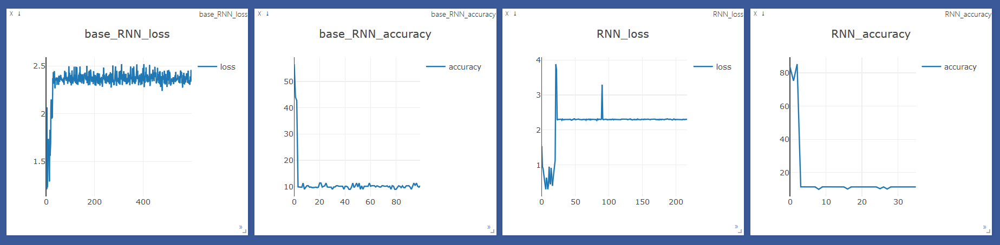</p>

#### 5.1.2 标准LSTM和LSTM

- [x] 实验结果

<p align="center">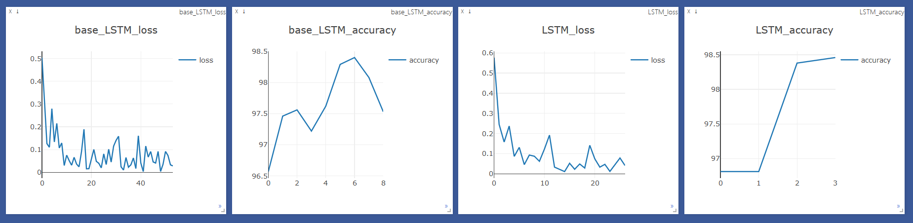</p>

#### 5.1.3 MetaRNN和MetaLSTM

- [x] 实验结果

<p align="center">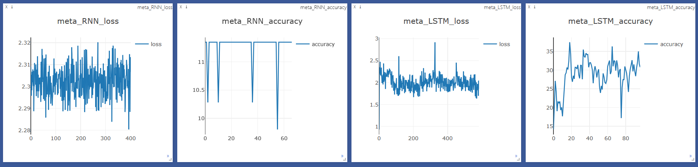</p>

### 5.2 测试集CoNLL-2003

[CoNLL-2003官网](https://www.clips.uantwerpen.be/conll2003/ner/)

CoNLL-2003是一个命名实体识别数据集，包含4类实体：PER, LOC, ORG, MISC

#### 5.2.1 标准RNN和RNN

- [x] 实验结果

<p align="center">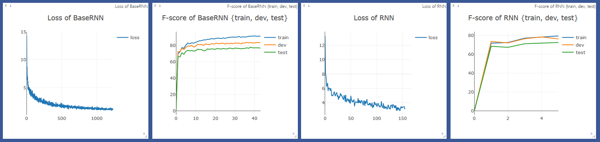</p>

*注：RNN图很快停止是因为训练时出现了NAN*

#### 5.2.2 标准LSTM和LSTM

- [x] 实验结果

<p align="center">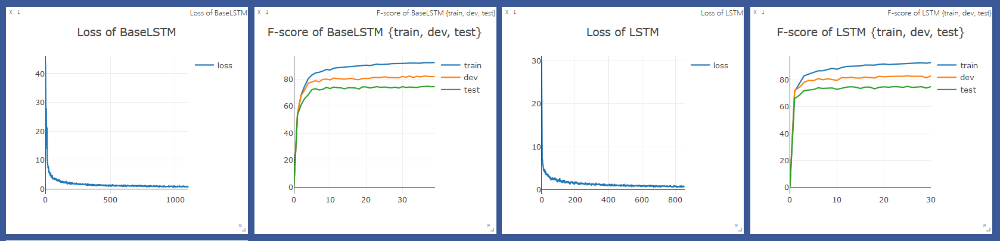</p>

#### 5.2.3 MetaRNN和MetaLSTM

- [x] 实验结果

<p align="center">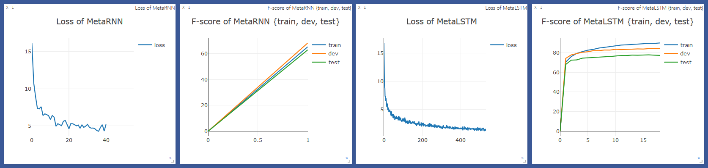</p>

*注：MetaRNN图很快停止是因为训练时出现了NAN*

### 5.3 冲刺state of the art

- [x] 梯度更新方法（SGD, Adagrad, Adadelta, Adam, Nadam ...）
- [x] 归一化方法（Dropout, Batch, Layer）
- [x] 词向量（cove）
- [x] 多任务学习（加标签）
- [ ] 注意力机制（待学习）
- [ ] 元学习（学习率更新）

#### 5.3.1 模型最优

- 双向
- 超参数

Model | Hidden_size | LR Method | Bidirectional | F1
:-: | :-: | :-: | :-: | :-:
BaseLSTM | 200| SGD(0.015) | True | 91.18
LSTM | 200 | SGD(0.015) | True | 91.04/91.20(drop_lstm)
MetaLSTM | 200 | SGD(0.015) | True | 90.97/90.54(drop_lstm)

#### 5.3.2 梯度更新方法

**结论**

- [x] 使用Adam，Loss下降最快
- [x] SGD训练结果最好
- [x] 我选择SGD

**实验结果**

- [x] Loss of Optimizers

<p align="center">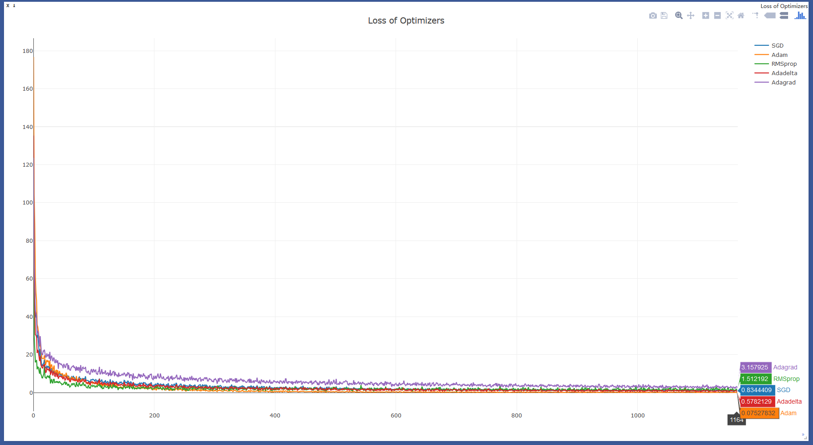</p>

- [x] F1 of Optimizers{train}

<p align="center">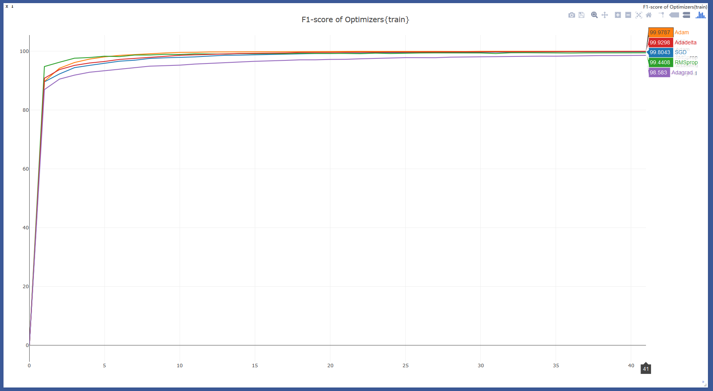</p>

- [x] F1 of Optimizers{dev}

<p align="center">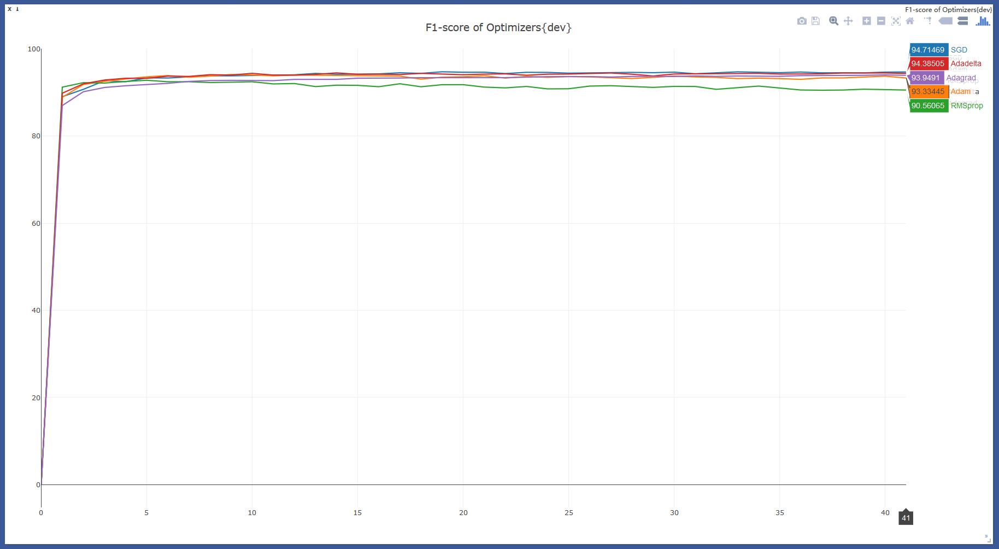</p>

- [x] F1 of Optimizers{test}

<p align="center">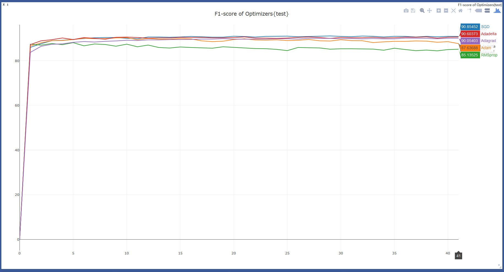</p>

#### 5.3.3 归一化方法

Method | Detail
:-: | :-:
Dropout | 在encoder的输出加dropout
Batch Norm | Batch Norm LSTM

#### 5.3.4 词向量

Model | Hidden_size| Layer | Embed Dict | F1
:-: | :-: | :-: | :-: | :-:
LSTM | 600 | 2 | golve.840B.300d | 90.35
LSTM | 600 | 2 | CoVe | 87.57

- [x] 实验结果

<p align="center">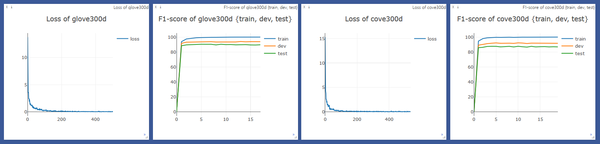</p>

#### 5.3.5 多任务学习

Dataset | STM | MTM
:-: | :-: | :-:
BioNLP13CG | 77.65 | **78.45**
BioNLP13PC | **83.28** | 82.49
CRAFT | 76.59 | **78.61**

**加标签**

将BioNLP13CG、BioNLP13PC和CRAFT三个数据集合并成一个，通过在句子首尾加标签的方式进行区分，例如：

    <BioNLP13CG>	S-BioNLP13CG
    This	O
    may	O
    reflect	O
    a	O
    transition	O
    ...
    </BioNLP13CG>	S-BioNLP13CG

在打分的时候，将这些标签去掉。

- [x] 实验结果

<p align="center">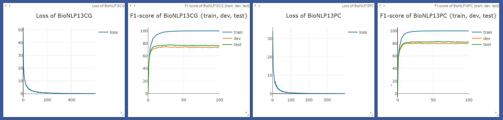</p>

<p align="center">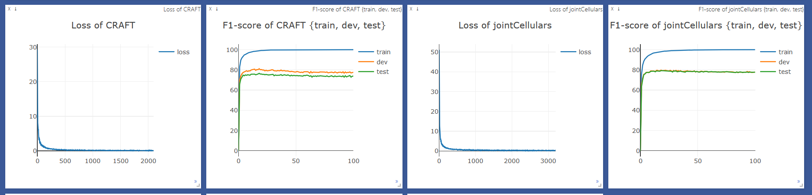</p>

<p align="center">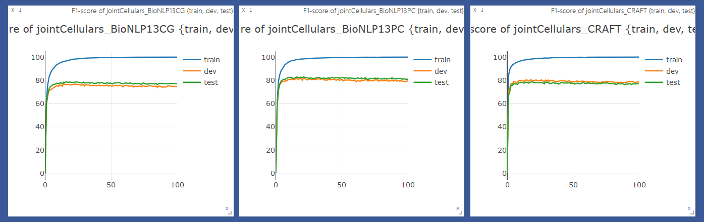</p>

- [x] 补充实验

**Cellular component group**

Dataset | STM | MTM
:-: | :-: | :-:
BioNLP13CG-cc | **74.72** | 70.81
BioNLP13PC-cc | **88.17** | 81.17
CRAFT-cc | 64.24 | **65.65**

**Cell group**

Dataset | STM | MTM
:-: | :-: | :-:
BioNLP13CG-cell | **85.61** | 81.75
CRAFT-cell | **89.33** | 88.79

**Chemical group**

Dataset | STM | MTM
:-: | :-: | :-:
BC4CHEMD | **82.90** | 82.10
BC5CDR-chem | 84.80 | **87.32**
BioNLP11ID-chem | **64.89** | 58.30
BioNLP13CG-chem | 66.15 | **72.78**
BioNLP13PC-chem | **74.27** | 70.80
CRAFT-chem | **80.48** | 79.34

**Disease group**

Dataset | STM | MTM
:-: | :-: | :-:
BC5CDR-disease | 78.18 | **78.25**
NCBI-disease | **85.62** | 83.44

**Species group**

Dataset | STM | MTM
:-: | :-: | :-:
BioNLP11ID-species | **68.80** | 66.93
BioNLP13CG-species | 79.80 | **80.08**
CRAFT-species | 97.84 | **97.99**
Linnaeus | **86.23** | 85.96

#### 5.3.6 注意力机制

- [ ] 实验结果

#### 5.3.7 元学习

- [ ] 实验结果

## 6 MetaLSTM的迁移能力

## 7 体会

- [x] SGD训练，学习率lr设置很重要，过大容易训练不了
- [x] LSTM比RNN及其变种更容易训练，即使学习率lr设置过大
- [x] RNN在训练过程中，Loss容易变成NAN，而无法进一步训练
- [x] 对于NER任务，加CRF，双向LSTM效果显著（2~3个点），hidden_emb有些许的提升（1个点）